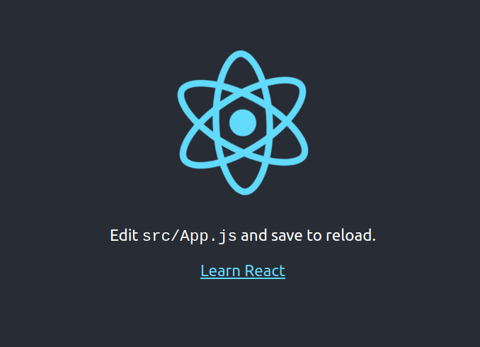
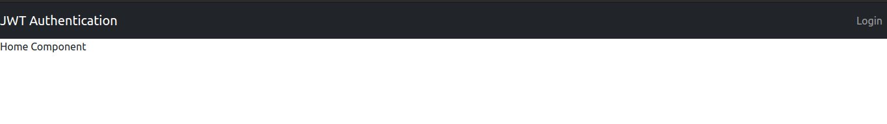
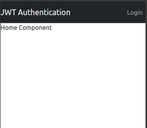
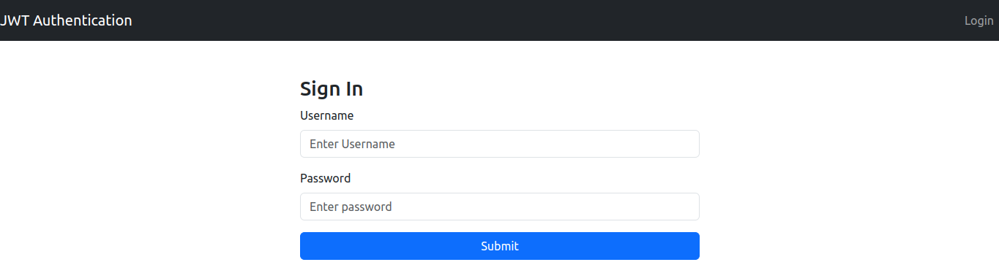
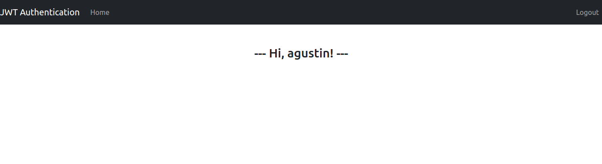
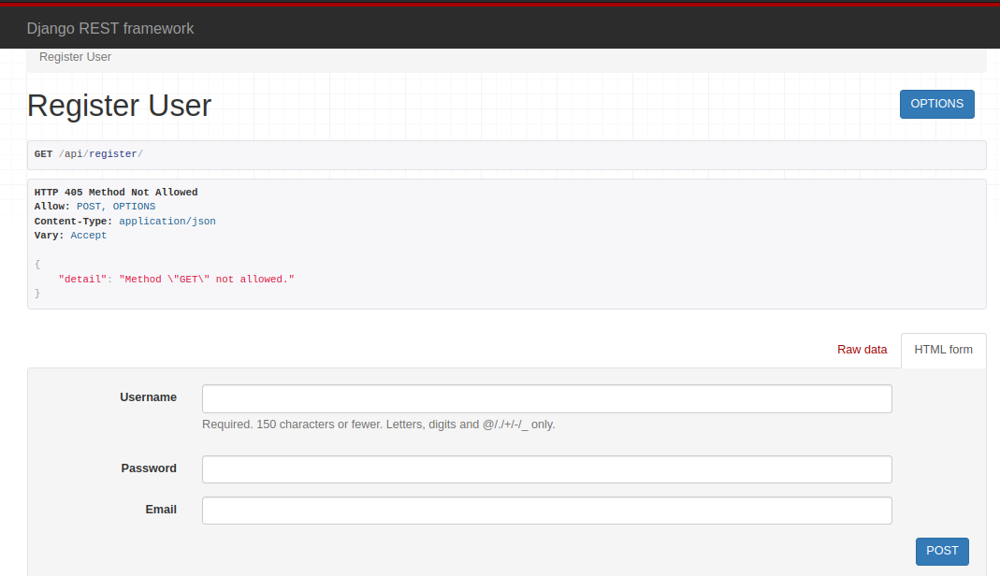
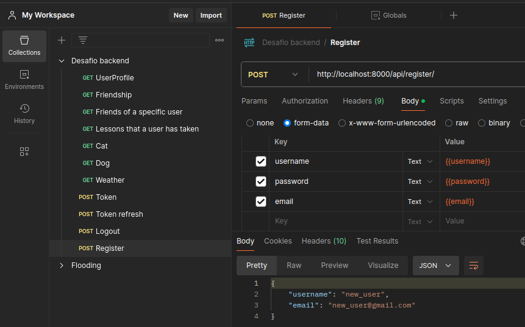
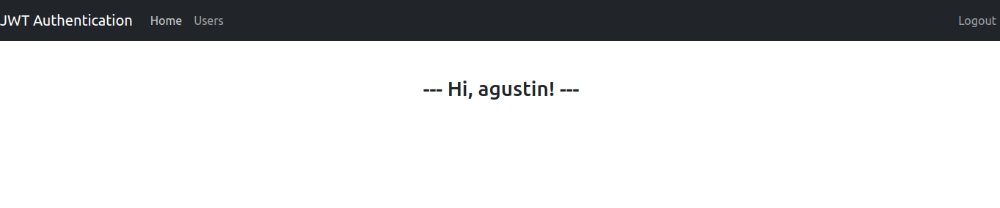
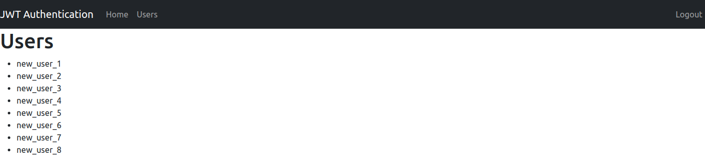

# Backend and Frontend

## Overview

This project comprises a complete stack application with a ready-to-use backend and a frontend that needs to be built using React. Below are the steps to set up the environment, create the frontend application, and get everything running.

## Backend

The backend of the application is already fully developed and provides all the necessary endpoints. Your task is to connect this backend with a React frontend to display the data and interact with the backend services.

## Backend configuration

1. Create and activate a virtual environment named 'venv':

    ```sh
    pip install virtualenv
    virtualenv -p python venv
    source venv/bin/activate
    ```

2. Install the necessary dependencies:

    ```sh
    pip install -r requirements.txt
    ```

3. Create a file named `.env` next to your `settings.py` file:

    ```sh
    touch .env
    ```

4. Copy the following template into your `.env` file and enter your personal credentials:

    ```plaintext
    SECRET_KEY=
    DEBUG=true
    DATABASE_NAME=
    DATABASE_USER=
    DATABASE_PASSWORD=
    DATABASE_HOST=localhost
    DATABASE_PORT=
    OPENWEATHER_API_KEY=
    ```

    Generate a secret key: [Djecrety](https://djecrety.ir/)
    
    Generate OpenWeather API Key: [OpenWeather](https://openweathermap.org/)


5. Perform migrations:

    ```sh
    python manage.py makemigrations
    python manage.py migrate
    ```

6. Run the project:

    ```sh
    python manage.py runserver
    ```

## Frontend Setup

To start working on the frontend, follow these steps:

### Installing Node.js and npm using the NVM

1. Installing NVM (Node Version Manager) script

To download and install the nvm script run:

```
curl -o- https://raw.githubusercontent.com/nvm-sh/nvm/v0.35.3/install.sh | bash
```

The command above will clone the NVM repository from Github to the ~/.nvm directory.

2.  Update the system’s repository cache using the command given below

```
sudo apt update
```

Now, upgrade the installed packages as well, using the command provided below

```
sudo apt upgrade
```

3. Type the command given below to install the Curl on your system

```
sudo apt install curl
```

4. Restart your terminal

5. Verify it worked

```
nvm --version
```

6. See what it does

```
nvm ls-remote
```

7. Install the latest LTS release of Node.js and npm

```
nvm install --lts
```

8. Verify it worked, and that the version is correct

```
node --version
```

```
npm --version
```

### Create the app frontend

1. Create the react app

```
npx create-react-app frontend
```

2. We access the frontend folder and install the following packages

```
cd frontend
```

```
npm i bootstrap
npm i react-bootstrap
npm i axios
npm i react-router-dom
npm i --save react-bootstrap-validation
npm i react-loader-spinner --save
npm i react-router-dom@6
```

3. To run the react app

```
npm start
```



### Components

After run the server successfully, we move further to design the application. So first, we will create the component folder inside the src folder.

After create the component folder in src we will create the login.js, logout.js, navigation.js and home.js. Basically, we have created the different file for different use.

1. So first, we will write the code for navigation bar in navigations.js file.

```
// frontend/src/components/Navigation.js

import Nav from 'react-bootstrap/Nav';
import Navbar from 'react-bootstrap/Navbar';
import React, { useState, useEffect } from 'react';

export function Navigation() {
  const [isAuth, setIsAuth] = useState(false);

  useEffect(() => {
    const token = localStorage.getItem('access_token');
    setIsAuth(token !== null);
  }, []); // Run only once when the component is mounted

  return (
    <div>
      <Navbar bg="dark" variant="dark">
        <Navbar.Brand href="/">JWT Authentication</Navbar.Brand>
        <Nav className="me-auto">
          {isAuth ? <Nav.Link href="/">Home</Nav.Link> : null}
        </Nav>
        <Nav>
          {isAuth ? (
            <Nav.Link href="/logout">Logout</Nav.Link>
          ) : (
            <Nav.Link href="/login">Login</Nav.Link>
          )}
        </Nav>
      </Navbar>
    </div>
  );
}

```

2. Then, we will complete the Home.js, login.js, and logout.js files

```
export const Home = () => {
    return <div>Home Component</div>;
};
```

```
export const Login = () => {
    return <div>Login Component</div>;
};
```

```
export const Logout = () => {
    return <div>Logout Component</div>;
};
```

3. After writing the code for the navigation page and the others, we need to add the route condition in our app.js file

```
import 'bootstrap/dist/css/bootstrap.min.css';
import './App.css';
import { BrowserRouter, Routes, Route } from 'react-router-dom';
import { Login } from "./components/Login";
import { Home } from "./components/Home";
import { Navigation } from './components/Navigation';
import { Logout } from './components/Logout';

function App() {
    return (
      <BrowserRouter>
        <Navigation />
        <Routes>
          <Route path="/" element={<Home />} />
          <Route path="/login" element={<Login />} />
          <Route path="/logout" element={<Logout />} />
        </Routes>
      </BrowserRouter>
    );
}

export default App;
```

4. We add the line import 'bootstrap/dist/css/bootstrap.min.css'; in index.js


### Images





### Login Implementation

To implement a login, we need to modify 3 backend files (settings.py, urls.py, and viewsets.py) and 4 frontend files (index.js, Home.js, Login.js, and Logout.js). Additionally, in the src folder, we will add a folder called 'interceptors' where we will create the 'axios.js' file to handle Axios requests and responses more efficiently and in a centralized manner.
We'll write the code for the login functionality in the login.js file:

```
// frontend/src/components/Login.js

import React, { useState } from "react";
import axios from "axios";
import { Form, Button, Container, Row, Col, Alert } from "react-bootstrap";

export const Login = () => {
  const [username, setUsername] = useState(''); 
  const [password, setPassword] = useState('');
  const [error, setError] = useState(''); // State to handle errors

  // Form submission method
  const submit = async (e) => {
    e.preventDefault();
    const user = {
      username: username,
      password: password,
    };

    try {
      // Create the POST request
      const { data } = await axios.post(
        "http://localhost:8000/api/token/",
        user,
        {
          headers: {
            "Content-Type": "application/json",
          },
          withCredentials: true, // Ensure that cookies are sent if necessary
        }
      );

      // Initialize the tokens in localStorage
      localStorage.clear();
      localStorage.setItem("access_token", data.access);
      localStorage.setItem("refresh_token", data.refresh);

      // Set the authorization token for future requests
      axios.defaults.headers.common["Authorization"] = `Bearer ${data.access}`;

      // Redirect the user to the homepage
      window.location.href = "/";
    } catch (err) {
      // Handle authentication errors
      if (err.response && err.response.data) {
        setError(err.response.data.detail || "Authentication error");
      } else {
        setError("Connection error");
      }
    }
  };

  return (
    <Container className="mt-5">
      <Row className="justify-content-md-center">
        <Col md="6">
          <div className="Auth-form-container">
            <form className="Auth-form" onSubmit={submit}>
              <div className="Auth-form-content">
                <h3 className="Auth-form-title">Sign In</h3>
                {error && <Alert variant="danger">{error}</Alert>}
                <Form.Group controlId="formUsername" className="mb-3">
                  <Form.Label>Username</Form.Label>
                  <Form.Control
                    type="text"
                    placeholder="Enter Username"
                    value={username}
                    required
                    onChange={(e) => setUsername(e.target.value)}
                  />
                </Form.Group>

                <Form.Group controlId="formPassword" className="mb-3">
                  <Form.Label>Password</Form.Label>
                  <Form.Control
                    type="password"
                    placeholder="Enter password"
                    value={password}
                    required
                    onChange={(e) => setPassword(e.target.value)}
                  />
                </Form.Group>

                <Button variant="primary" type="submit" className="w-100">
                  Submit
                </Button>
              </div>
            </form>
          </div>
        </Col>
      </Row>
    </Container>
  );
};

```

Let’s look what we have done. First, we have initialize the react js packages. Second, we have create the function which name is Login. Inside the login function we have created the submit function. Inside the submit function we have written the axios post method to fetch the access token and refresh token. After fetch the token, we have store this tokens in local storage and navigate to the particular location which you want. For this case, I have route to my home URL. Then, we have design the Login form with username and password fields. Whenever, we click on submit button, the submit function is called and fetch the data from our backend login API. If it is successful than we get the access token and navigate to other page or home page otherwise it gives error in console.
After design the Login page, let’s move on to write the code for home page in our home.js file:

```
// Import the react JS packages
import {useEffect, useState} from "react";
import axios from "axios";
// Define the Login function.
export const Home = () => {
     const [message, setMessage] = useState('');
     useEffect(() => {
        if(localStorage.getItem('access_token') === null){                   
            window.location.href = '/login'
        }
        else{
         (async () => {
           try {
             const {data} = await axios.get(   
                            'http://localhost:8000/api/home/', {
                             headers: {
                                'Content-Type': 'application/json'
                             }}
                           );
             setMessage(data.message);
          } catch (e) {
            console.log('not auth')
          }
         })()};
     }, []);
     return (
        <div className="form-signin mt-5 text-center">
          <h3> --- {message} --- </h3>
        </div>
     );
}
```

First, we initialized the React JS packages. Second, we created a function named Home. Inside Home, we used useState to store the message data and useEffect, which runs every time the component is rendered. Within useEffect, we wrote an if-else condition to check whether the access token is present. If the access token is null in localStorage, we will redirect to the login page; otherwise, if we have the token, we will create a GET request to fetch the data from the API and set the message. Finally, we wrote the HTML code to display the message.
We have design the home page also but, we all know that our access token is valid for very short time. After short time when we refresh the page, we will get the 401 unauthorized error because our access token is invalid. But we also know that in backend, we have created the refresh token API, which will generate the new access token and refresh token.

But the problem is how we know or after how much time access token is invalid or not. To resolve this problem, we use the interceptor in react js or in other words we can say middleware. Basically, Interceptors are methods which are triggered before or after the main method. So in this case we have using the axios interceptor. There are two types of interceptors:

1. Request interceptor: — It allows you to write or execute your code before the request gets sent.
2. Response interceptor: — It allows you to write or execute your code before response reaches the calling end.

So in our case, we have using the response interceptor because, we have to check the response. To write the response interceptor code first, we make the interceptor folder. Inside the interceptor folder create the axiox.js file. Inside the axios.js file, we will write the code:

```

import axios from "axios";

// Variable to prevent multiple simultaneous renewals
let isRefreshing = false;
let failedQueue = [];

// Function to process the queue of failed requests
const processQueue = (error, token = null) => {
  failedQueue.forEach(prom => {
    if (error) {
      prom.reject(error);
    } else {
      prom.resolve(token);
    }
  });

  failedQueue = [];
};

// Add a response interceptor
axios.interceptors.response.use(
  response => response,
  async error => {
    const originalRequest = error.config;

    // Check if the error is 401 (Unauthorized) and if renewal has not been attempted
    if (error.response.status === 401 && !originalRequest._retry) {
      if (isRefreshing) {
        // If the token is already being renewed, add the request to the queue
        return new Promise(function(resolve, reject) {
          failedQueue.push({ resolve, reject });
        })
          .then(token => {
            originalRequest.headers['Authorization'] = 'Bearer ' + token;
            return axios(originalRequest);
          })
          .catch(err => {
            return Promise.reject(err);
          });
      }

      originalRequest._retry = true;
      isRefreshing = true;

      const refreshToken = localStorage.getItem('refresh_token');

      if (!refreshToken) {
        // If there is no refresh token, redirect to login
        window.location.href = '/login';
        return Promise.reject(error);
      }

      try {
        // Request a new access token using the refresh token
        const response = await axios.post(
          'http://localhost:8000/api/token/refresh/',
          { refresh: refreshToken },
          {
            headers: { 'Content-Type': 'application/json' },
            withCredentials: true,
          }
        );

        if (response.status === 200) {
          const newAccessToken = response.data.access;
          localStorage.setItem('access_token', newAccessToken);

          // Update the authorization header in axios
          axios.defaults.headers.common['Authorization'] = `Bearer ${newAccessToken}`;
          originalRequest.headers['Authorization'] = `Bearer ${newAccessToken}`;

          processQueue(null, newAccessToken);

          return axios(originalRequest);
        }
      } catch (err) {
        processQueue(err, null);
        localStorage.removeItem('access_token');
        localStorage.removeItem('refresh_token');
        window.location.href = '/login';
        return Promise.reject(err);
      } finally {
        isRefreshing = false;
      }
    }

    return Promise.reject(error);
  }
);

// Configure the axios instance to include the token in each request
axios.interceptors.request.use(
  config => {
    const token = localStorage.getItem('access_token');
    if (token) {
      config.headers['Authorization'] = `Bearer ${token}`;
    }
    return config;
  },
  error => Promise.reject(error)
);

export default axios;

```

Let’s look what we have done. First, we have import the axios package and then, create the axios response interceptor. Now, Every single time a request is made with the axios instance, if there are no errors, it just works as expected.

When there is error occur first, we will check the error code. If the error code is 401, we need to refresh the token. To refresh the token, we will create the POST request and get the new access token and refresh token. After get the token, we will reinitialize the token in localStorage and send the original request.

After create the response interceptor. We have to the add the interceptor location in our index.js file.

```
import './interceptors/axios';
```

Now, we will write the code for logout functionality in logout.js file:

```
import {useEffect} from "react";
import axios from "axios";

export const Logout = () => {
    useEffect(() => {
       (async () => {
         try {
           await axios.post(
             'http://localhost:8000/api/logout/',
             { refresh_token: localStorage.getItem('refresh_token') },
             {
               headers: {'Content-Type': 'application/json'},
               withCredentials: true
             }
           );
           
           // Clear the tokens and unset authentication
           localStorage.clear();
           axios.defaults.headers.common['Authorization'] = null;

           // Redirect to login
           window.location.href = '/login';
         } catch (e) {
           console.log('Logout not working', e);
         }
       })();
    }, []);

    return <div></div>;
};

```

To add the logout functionality, we have declares the packages and use the useEffect hooks. Whenever we click on logout button, it call the backend logout API and remove all the tokens from local storage and navigate to login page.
To avoid CORS issues, we will add the following code to our settings.py file:

```
CORS_ALLOWED_ORIGINS = [
    'http://localhost:3000',
]

CORS_ALLOW_CREDENTIALS = True
```

We will add the following functions for logout and home to our viewsets.py file:

```
from rest_framework_simplejwt.tokens import RefreshToken

class LogoutView(APIView):
    permission_classes = (permissions.IsAuthenticated,)

    def post(self, request):
        try:
            refresh_token = request.data.get("refresh_token")
            token = RefreshToken(refresh_token)
            token.blacklist()
            return Response(status=status.HTTP_205_RESET_CONTENT)
        except Exception as e:
            return Response({"error": str(e)}, status=status.HTTP_400_BAD_REQUEST)

class HomeView(APIView):
    permission_classes = (permissions.IsAuthenticated,)
    
    def get(self, request):
        # Get the current user
        user = request.user
        data = {
            "message": f"Hi, {user.username}!"
        }
        return Response(data)
```

Finally, we'll add the URLs in our urls.py file:

```
path('token/', jwt_views.TokenObtainPairView.as_view(), name ='token_obtain_pair'),
path('token/refresh/', jwt_views.TokenRefreshView.as_view(), name ='token_refresh'),
path('logout/', LogoutView.as_view(), name = 'logout'),
path('home/', HomeView.as_view(), name='home'),
```

jwt_views.TokenObtainPairView is a view provided by the Django REST Framework Simple JWT package that allows users to obtain a JSON Web Token (JWT) pair, consisting of an access token and a refresh token. When a user submits their credentials (username and password), this view validates the credentials and returns the tokens if they are correct. The access token is used for authentication in subsequent requests, while the refresh token can be used to obtain a new access token when the current one expires.






### Add Protected Routes

We added the PrivateRoute component, which will check if the user is authenticated before allowing access to a specific route. If the user is not authenticated, it will redirect them to the login page. We created the PrivateRoute folder and inside it the PrivateRoute.js file:

```
import React from 'react';
import { Navigate } from 'react-router-dom';

const PrivateRoute = ({ children }) => {
  const isAuth = !!localStorage.getItem('access_token');

  return isAuth ? children : <Navigate to="/login" />;
};

export default PrivateRoute;
```

Now, you need to wrap the routes you want to protect. In the App.js file, we import the created component and use it like this:

```
import PrivateRoute from './components/PrivateRoute/PrivateRoute';
```

```
<Route path="/" element={<PrivateRoute><Home /></PrivateRoute>} />
```

Make sure the links in your navigation bar properly reflect the user's authentication state. We modified the Navigation.js file:

```

import Nav from 'react-bootstrap/Nav';
import Navbar from 'react-bootstrap/Navbar';
import React, { useState, useEffect } from 'react';
import { Link } from 'react-router-dom';

export function Navigation() {
  const [isAuth, setIsAuth] = useState(false);

  useEffect(() => {
    const token = localStorage.getItem('access_token');
    setIsAuth(token !== null);
  }, []);

  return (
    <div>
      <Navbar bg="dark" variant="dark" expand="lg">
        <Navbar.Brand as={Link} to="/">JWT Authentication</Navbar.Brand>
        <Navbar.Toggle aria-controls="basic-navbar-nav" />
        <Navbar.Collapse id="basic-navbar-nav">
          <Nav className="me-auto">
            {isAuth && <Nav.Link as={Link} to="/">Home</Nav.Link>}
            {/* Agrega más enlaces protegidos aquí si es necesario */}
          </Nav>
          <Nav>
            {isAuth ? (
              <Nav.Link as={Link} to="/logout">Logout</Nav.Link>
            ) : (
              <Nav.Link as={Link} to="/login">Login</Nav.Link>
            )}
          </Nav>
        </Navbar.Collapse>
      </Navbar>
    </div>
  );
}

```

### Account Creation: Adding Registration

Our serializers.py must handle user creation with encrypted passwords and the necessary validation:

```
class UserSerializer(serializers.ModelSerializer):
    username = serializers.CharField(
        required=True,
        validators=[UniqueValidator(queryset=User.objects.all())]
    )
    email = serializers.EmailField(
        required=True,
        validators=[UniqueValidator(queryset=User.objects.all())]
    )
    password = serializers.CharField(write_only=True, required=True, style={'input_type': 'password'})

    class Meta:
        model = User
        fields = ['username', 'password', 'email']
        extra_kwargs = {
            'password': {'write_only': True}
        }

    def create(self, validated_data):
        user = User.objects.create_user(
            username=validated_data['username'],
            email=validated_data['email'],
            password=validated_data['password']
        )
        return user
```

- write_only ensures that the password is not returned in API responses.
- style={'input_type': 'password'} helps the frontend recognize that this field should be treated as a password.
- UniqueValidator ensures that the username and email are unique.

In our RegisterUserView from viewsets.py, we must allow full access to any user by using AllowAny:

```
from rest_framework.permissions import AllowAny

class RegisterUserView(generics.CreateAPIView):
    queryset = User.objects.all()
    serializer_class = UserSerializer
    permission_classes = [AllowAny]
```

- Generics.CreateAPIView provides a view that handles the creation of objects.

We added the API URLs in our urls.py:

```
path('register/', RegisterUserView.as_view(), name='register'),
```

Remember to enable CORS in our 'settings.py':

```
CORS_ALLOWED_ORIGINS = [
    'http://localhost:3000',
]

CORS_ALLOW_CREDENTIALS = True

```

Finally, we must test the endpoint both in the browser and in Postman:





The username, password, and email must be provided in the global variables.

We applied the necessary migrations:

```
python manage.py makemigrations
python manage.py migrate
```

Let's create a new component called 'Register.js' in 'frontend/src/components/':

```
import React, { useState } from "react";
import axios from "axios";
import { Form, Button, Container, Row, Col, Alert } from "react-bootstrap";

export const Register = () => {
  const [username, setUsername] = useState(''); 
  const [email, setEmail] = useState('');
  const [password, setPassword] = useState('');
  const [confirmPassword, setConfirmPassword] = useState('');
  const [error, setError] = useState(''); // State to handle errors
  const [success, setSuccess] = useState(''); // State for success messages

  // Form submission method
  const submit = async (e) => {
    e.preventDefault();

    // Simple frontend validation
    if (password !== confirmPassword) {
      setError("Passwords do not match");
      return;
    }

    const user = {
      username: username,
      email: email,
      password: password,
    };

    try {
      const { data } = await axios.post(
        "http://localhost:8000/api/register/",
        user,
        {
          headers: {
            "Content-Type": "application/json",
          },
          withCredentials: true, // Si es necesario
        }
      );

      setSuccess("Successful registration. You can log in now.");
      setError('');
      // Opcional: Redireccionar al login automáticamente
      // window.location.href = "/login";
    } catch (err) {
      if (err.response && err.response.data) {
        // Manejar errores de validación
        const errorMessages = Object.values(err.response.data).flat();
        setError(errorMessages.join(" "));
      } else {
        setError("Connection error");
      }
      setSuccess('');
    }
  };

  return (
    <Container className="mt-5">
      <Row className="justify-content-md-center">
        <Col md="6">
          <div className="Auth-form-container">
            <form className="Auth-form" onSubmit={submit}>
              <div className="Auth-form-content">
                <h3 className="Auth-form-title">Registro</h3>
                {error && <Alert variant="danger">{error}</Alert>}
                {success && <Alert variant="success">{success}</Alert>}
                <Form.Group controlId="formUsername" className="mb-3">
                  <Form.Label>Username</Form.Label>
                  <Form.Control
                    type="text"
                    placeholder="Enter Username"
                    value={username}
                    required
                    onChange={(e) => setUsername(e.target.value)}
                  />
                </Form.Group>

                <Form.Group controlId="formEmail" className="mb-3">
                  <Form.Label>Email</Form.Label>
                  <Form.Control
                    type="email"
                    placeholder="Enter Email"
                    value={email}
                    required
                    onChange={(e) => setEmail(e.target.value)}
                  />
                </Form.Group>

                <Form.Group controlId="formPassword" className="mb-3">
                  <Form.Label>Contraseña</Form.Label>
                  <Form.Control
                    type="password"
                    placeholder="Enter password"
                    value={password}
                    required
                    onChange={(e) => setPassword(e.target.value)}
                  />
                </Form.Group>

                <Form.Group controlId="formConfirmPassword" className="mb-3">
                  <Form.Label>Confirmar Contraseña</Form.Label>
                  <Form.Control
                    type="password"
                    placeholder="Confirm password"
                    value={confirmPassword}
                    required
                    onChange={(e) => setConfirmPassword(e.target.value)}
                  />
                </Form.Group>

                <Button variant="primary" type="submit" className="w-100">
                  Register
                </Button>
              </div>
            </form>
          </div>
        </Col>
      </Row>
    </Container>
  );
};

```

We need to add a route for the registration component in your 'App.js' file:

```
<Route path="/register" element={<Register />} />
```

Include a link to the registration page in 'Navigation.js' when the user is not authenticated:

```
{isAuth ? (
  <>
    <Nav.Link as={Link} to="/logout">Logout</Nav.Link>
  </>
) : (
  <>
    <Nav.Link as={Link} to="/login">Login</Nav.Link>
    <Nav.Link as={Link} to="/register">Register</Nav.Link> {/* New link */}
  </>
)}

```

You can decide whether to redirect the user to the login page after a successful registration or if you prefer to log them in automatically. In the Register.js component:

```
// window.location.href = "/login";
```

Security Considerations:

1. Django automatically handles password encryption through User.objects.create_user(), so you don't need to worry about it in the backend.

2. While storing tokens in localStorage is common, it is susceptible to Cross-Site Scripting (XSS) attacks. Consider more secure alternatives, such as HttpOnly cookies, if security is a critical concern.

3. Make sure both the frontend and backend properly validate and sanitize user input to prevent code injections and other attacks.

4. In a production environment, always use HTTPS to protect the transmission of sensitive data.

5. To handle forms more efficiently and with better validation, you might consider using libraries like react-hook-form or Formik.

6. You can implement an email confirmation system to verify that users have access to the email addresses they register.

### User List

Finally, we are going to create a "Users" button next to the Home button that will list all the users. Obviously, these should be the ones who are not staff members. We will start with the backend, which involves the 'serializers', 'urls', and 'viewsets' files.

1. We will add a new function to the UserProfileViewSet class in the viewsets.py file. The function will list the users who are not staff members. The class along with its functions will look as follows:

```
class UserProfileViewSet(ModelViewSet):
    queryset = UserProfile.objects.all()
    serializer_class = UserProfileSerializer
    permission_classes = [permissions.IsAuthenticated]

    # List of all friends for a specific user

    @action(detail=True, methods=['get'])
    def friends(self, request, pk=None):
        user_profile = self.get_object()
        friends = user_profile.following.all()
        serializer = FriendSerializer(friends, many=True)
        return Response(serializer.data)
    
    # List of lessons taken by friends of a specific user

    @action(detail=True, methods=['get'])
    def friends_lessons(self, request, pk=None):
        user_profile = self.get_object()
        friends = user_profile.following.all()
        taken_lessons = TakenLesson.objects.filter(user__in=friends)
        serializer = UserLessonSerializer(taken_lessons, many=True)
        return Response(serializer.data)
    
    # List the users who are not staff members
    
    @action(detail=False, methods=['get'], url_path='non-staff-users')
    def non_staff_users(self, request):
        non_staff_users = UserProfile.objects.filter(user__is_staff=False)
        serializer = UserProfileSerializer(non_staff_users, many=True)
        return Response(serializer.data)
```

2. We will add the corresponding URL in the urls.py file of the API:

```
path('usersProfile/non-staff-users/', UserProfileViewSet.as_view({'get': 'non_staff_users'}), name='non-staff-users'),
```

3. We need to make some modifications in the serializers.py file, which involves creating a new class called "UserSerializer" and modifying the "UserProfileSerializer." The previous class named "UserSerializer" that was used for user registration will be renamed to "UserCreateSerializer":


```
from rest_framework import serializers
from rest_framework.serializers import ModelSerializer
from rest_framework.validators import UniqueValidator
from ..models import Lesson, UserProfile, TakenLesson, Friendship
from django.contrib.auth.models import User

# Convert your models to JSON

class LessonSerializer(ModelSerializer):
    class Meta:
        model = Lesson
        fields = "__all__"

class UserSerializer(serializers.ModelSerializer):
    class Meta:
        model = User
        fields = ['id', 'username', 'email']

class UserProfileSerializer(serializers.ModelSerializer):
    user = UserSerializer()

    class Meta:
        model = UserProfile
        fields = ['id', 'user', 'followers', 'following']

class FriendSerializer(serializers.ModelSerializer):
    class Meta:
        model = UserProfile
        fields = ['id', 'user']

class FriendshipSerializer(serializers.ModelSerializer):
    class Meta:
        model = Friendship
        fields = "__all__"

class TakenLessonSerializer(ModelSerializer):
    class Meta:
        model = TakenLesson
        fields = "__all__"

class UserLessonSerializer(serializers.ModelSerializer):
    lesson = LessonSerializer()

    class Meta:
        model = TakenLesson
        fields = ['lesson']

class UserCreateSerializer(serializers.ModelSerializer):
    username = serializers.CharField(required=True,validators=[UniqueValidator(queryset=User.objects.all())])
    email = serializers.EmailField(required=True,validators=[UniqueValidator(queryset=User.objects.all())])
    password = serializers.CharField(write_only=True, required=True, style={'input_type': 'password'})

    class Meta:
        model = User
        fields = ['username', 'password', 'email']
        extra_kwargs = {
            'password': {'write_only': True}
        }

    def create(self, validated_data):
        user = User.objects.create_user(
            username=validated_data['username'],
            email=validated_data['email'],
            password=validated_data['password']
        )
        return user
```

Now we move on to the frontend. This involves the "Navigation.js" and "App.js" files. We should also create the new "Users" component.

4. We created the new "Users" component in frontend/src/components/Users.js:

```
import React, { useEffect, useState } from 'react';
import axios from 'axios';
function Users() {
    const [users, setUsers] = useState([]);
    useEffect(() => {
        // Realiza la solicitud al endpoint que creaste en el backend
        axios.get('http://localhost:8000//api/usersProfile/non-staff-users/') 
            .then(response => {
                setUsers(response.data);
            })
            .catch(error => {
                console.error('Error fetching non-staff users:', error);
            });
    }, []);
    return (
        <div>
            <h1>Users</h1>
            <ul>
                {users.map(user => (
                    <li key={user.id}>{user.user.username}</li>
                ))}
            </ul>
        </div>
    );
}
export default Users;
```

5. Add a new protected link in frontend/src/components/Navigation.js

```
{isAuth && <Nav.Link as={Link} to="/users">Users</Nav.Link>}
```

6. Finally, we add the last protected route to our file frontend/src/App.js

```
<Route path="/users" element={<PrivateRoute><Users /></PrivateRoute>} />
```

The following images show the final result:





### Code Structure (using the tree command)

In Visual Studio Code, there is no option to copy the entire file structure. However, you can use the `tree` command, which displays directories in a tree-like structure. But if you're working with a Django and React project, the `tree` command will show a lot of unnecessary files (such as configuration files, `virtualenv`, or `node_modules`). You can use some `tree` options to exclude directories or files that aren't essential and just view the basics:

```bash
tree -L 5 -I "node_modules|__pycache__|migrations|*.pyc|env|venv|build|dist|coverage|static|media"
```

- -L5 specifies the depth level.
- -I stands for "ignore", so it will exclude anything that matches the patterns defined inside the quotes.

```
.
├── documentation
│   ├── arch_uml
│   │   ├── uml
│   │   └── uml_image.png
│   └── images
│       ├── endpoint_register.png
│       ├── frontend-home-1.png
│       ├── frontend-home-2.png
│       ├── login_home_1.png
│       ├── login_home_2.png
│       ├── postman.png
│       ├── postman_register.png
│       ├── react-project-complete-1.png
│       ├── react-project-complete-2.png
│       └── react-project.png
├── frontend
│   ├── package.json
│   ├── package-lock.json
│   ├── public
│   │   ├── favicon.ico
│   │   ├── index.html
│   │   ├── logo192.png
│   │   ├── logo512.png
│   │   ├── manifest.json
│   │   └── robots.txt
│   ├── README.md
│   └── src
│       ├── App.css
│       ├── App.js
│       ├── App.test.js
│       ├── components
│       │   ├── Home.js
│       │   ├── Login.js
│       │   ├── Logout.js
│       │   ├── Navigation.js
│       │   ├── PrivateRoute
│       │   │   ├── PrivateRoute.css
│       │   │   └── PrivateRoute.js
│       │   ├── Register.js
│       │   └── Users.js
│       ├── index.css
│       ├── index.js
│       ├── interceptors
│       │   └── axios.js
│       ├── logo.svg
│       ├── reportWebVitals.js
│       └── setupTests.js
├── manage.py
├── README.md
├── requirements.txt
├── social
│   ├── asgi.py
│   ├── __init__.py
│   ├── settings.py
│   ├── urls.py
│   └── wsgi.py
├── socialApp
│   ├── admin.py
│   ├── api
│   │   ├── cat_api.py
│   │   ├── dog_api.py
│   │   ├── router.py
│   │   ├── serializers.py
│   │   ├── urls.py
│   │   ├── viewsets.py
│   │   └── weather_api.py
│   ├── apps.py
│   ├── __init__.py
│   ├── models.py
│   ├── signals.py
│   ├── tests.py
│   └── views.py
└── tracking.log

12 directories, 61 files
```


## Run the Project

1. Open a terminal in Visual Studio Code and specify version 22 of nvm:

```
nvm use 22
```

2. Install dependencies in the same terminal:

```
npm install
```

3. Open a new terminal, activate the virtual environment:

```
source venv/bin/activate
```

4. Install backend dependencies in the second terminal:
```
pip install -r requirements.txt
```

5. In the second terminal, Start the backend application:

```
python manage.py runserver
```

6. Start the application frontend in the first terminal:

```
npm start
```

## Contact

If you have any questions or suggestions, feel free to contact me via email.
